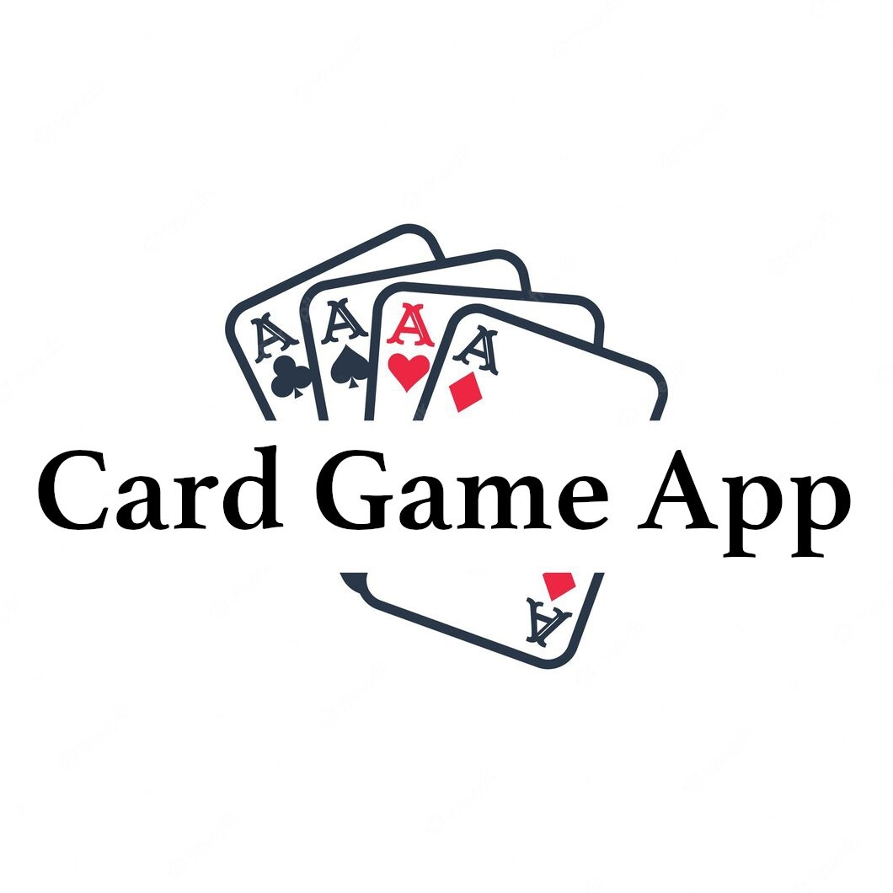

# Exercise project "CardGameApp"
Playing Cards is FUN!

## Team
- Eric Langer (Docs)
- Felix Ossmann (Testing)
- Hannes Brottrager (Data)
- Markus Hilbert (Lead/Architecture)

## Targets
Create a small but extendable project in Java using OOP concepts and prozedures.

### Prozedures
- if/else
- case
- while/for
- early return

### OOP
- Encapsulation
- Inheritance
- Abstraction
- Interfaces
- Types
  - Primitive Types
  - Complex Types
- Classes
  - Constructors
  - Setters & Getters
  - Modifiers
    - public
    - private 
    - protected
    - abstract
    - final
  - Return value Type

### Java STD Classes:
- Scanner (Terminal input)
- StringBuffer
- File I/O
- Date

### Frameworks
- Logging via java.util.logging.*
- Testing via "JUnit"
- Code versioning via GIT

### Documentation
- Write a project documentation in MarkDown
- Write a code documentation with javadoc

## NOT targets
- a (G)UI
- a Gaming AI to play against
- a production ready application

# CardGameApp
Base idea of this project is to create an extensible Base of (abstract) Types, to create and play several different Card Games.
Each Game implements it's own set of rules how

Possible Games are: ([List of Card Games by Amount of Cards](https://de.wikipedia.org/wiki/Liste_von_Kartenspielen_nach_Kartenanzahl_geordnet))
- BlackJack (17+4)
- Schnapsen (Cards could be "Französisch" or "DoppelDeutsch")
  - Schnapsen
  - BauernSchnapsen
  - TalonSchnapsen (DreierSchnapsen)
- Uno
- Rommé
- etc

### Diagram
<!-- insert image here -->

### Card
Is an abstract class to represent a gaming card in a Deck of Cards.

### Card designs
- [Poker](https://www.piatnik-individual.com/produkt/4-eckzeichen-nur-rueckseite-gestalten-hochladen/)
- [Französische Schnapskarten](https://www.piatnik-individual.com/produkt/franzoesische-25-karten-nur-rueckseite-gestalten-hochladen/)
- [Doppeldeutsche Schnapskarten](https://www.piatnik-individual.com/produkt/doppeldeutsche-36-karten-nur-rueckseite-gestalten/)

### Deck
Is a set of Cards.
Each Card is unique in **most** decks.

### Player
Is a Person with a PlayerName.

### Dealer
Is a Person dealing Cards to Player(s).

### Game
The specific game itself. Depending on the game, rules, decks, amount of players, ... are different.

### Pick Pile
Is one or more Cards Decks flattened to a random List of Cards from given Decks.
Players or Dealer can pull one or more Cards from this Pile.

### Discard Pile
Is a List of Cards, Dealers or Players discard.

### Tray
A Game and/or a Player can have a Tray for Cards already played or tricks

### Exceptions
#### Game
- TooManyPlayers
- NotEnoughPlayers
- PlayerNotOldEnough
- NoMoreCardsOnStack
- StackIsEmpty

### Interfaces

#### Stakeable
Allows a Game and Player to be gamble.

### Code Structure
Use [Maven Styled Structure](https://maven.apache.org/guides/introduction/introduction-to-the-standard-directory-layout.html)
- cardgame
  - src
    - main/java/ddb/international
      - card
        - Card.java
        - PokerCard.java
        - images
      - deck
        - Deck.java
        - PokerDeck.java
        - cards
          - uno.csv
          - schnapsen.csv|.json    
      - pile
        - 
      - person
      - game
        - Game.java
        - PokerGame.java
        - BlackJackGame.java
    - test
      - CardTest.java
      - PokerCardTest.java
    - resources
      - cards
        - uno.csv
        - schnapsen.csv|.json
      - gamerules
        - uno.md
        - blackjack.md

## Storage (optional)
- Hibernate (ORM)
